# 📱 Pulse - Server & Container Monitoring App

**Real-time infrastructure monitoring at your fingertips**

[Features](#-features) • [Screenshots](#-screenshots) • [Installation](#-installation) • [Architecture](#-architecture) • [Contributing](#-contributing)

---

## Overview

**Pulse** is a powerful mobile application for monitoring servers and containers in real-time. Built with React Native and Expo, it provides system administrators and DevOps engineers with instant access to critical infrastructure metrics from anywhere.

### Why Pulse?

- **Real-time Monitoring** - Get live updates every 2 minutes from your servers
- **Comprehensive Metrics** - CPU, Memory, Disk, Network, and Container stats
- **Smart Alerts** - Instant notifications when thresholds are exceeded
- **Mobile-First** - Beautiful, intuitive interface optimized for iOS and Android
- **Secure** - JWT authentication and encrypted data transmission

---

## Features

### Core Functionality

#### Server Monitoring

- Real-time CPU usage tracking with load averages
- Memory utilization and cache statistics
- Disk I/O metrics and space monitoring
- Network bandwidth and packet statistics
- Process monitoring and system uptime

#### Container Management

- Docker container health status
- Container resource consumption
- Quick start/stop/restart actions
- Container logs viewer
- Multi-container orchestration support

#### Intelligent Alerts

- Customizable threshold alerts
- Push notifications for critical events
- Alert history and acknowledgment
- Multi-channel notifications (push, email)

#### Data Visualization

- Interactive charts and graphs
- Historical data analysis
- Trend identification
- Exportable reports
- Custom date range selection

#### Multi-Server Support

- Manage multiple servers from one dashboard
- Server grouping and tagging
- Quick server switching
- Server status overview
- Bulk operations

---

### Technology Stack

- **Framework**: [Expo](https://expo.dev) (SDK 52)
- **Language**: TypeScript 5.x
- **UI Framework**: React Native 0.76
- **Navigation**: Expo Router (File-based routing)
- **State Management**: Redux Toolkit + RTK Query
- **Charts**: React Native Chart Kit / Victory Native
- **HTTP Client**: Axios
- **Real-time**: Socket.io Client
- **Storage**: AsyncStorage
- **Forms**: React Hook Form + Zod
- **Notifications**: Expo Notifications
- **Authentication**: JWT + Secure Store

## Screenshots

  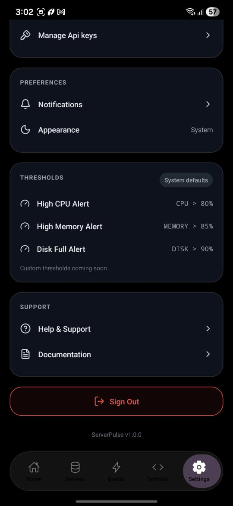
  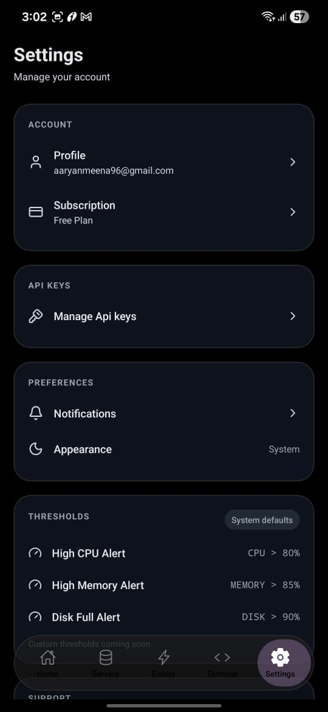
  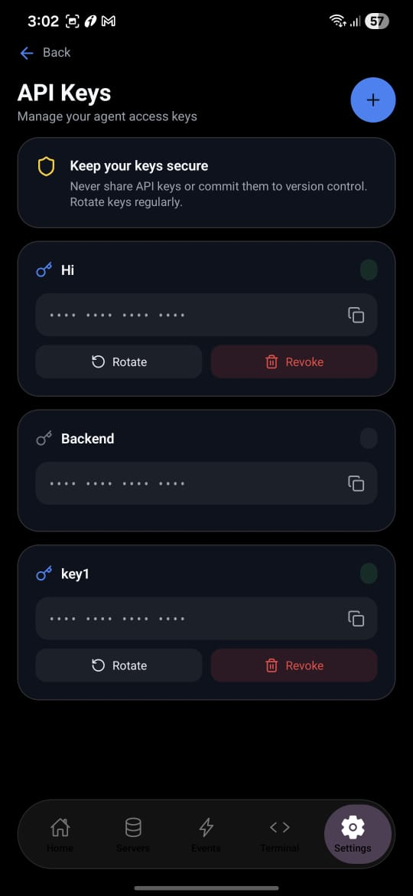
  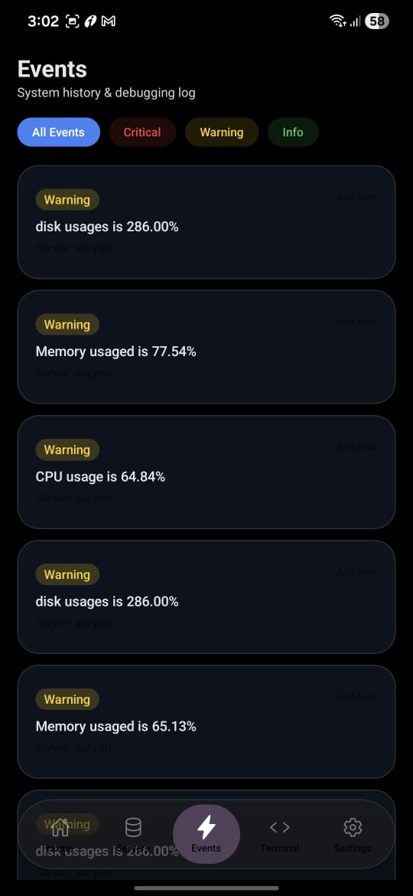
  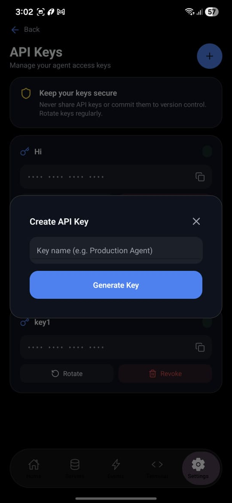
  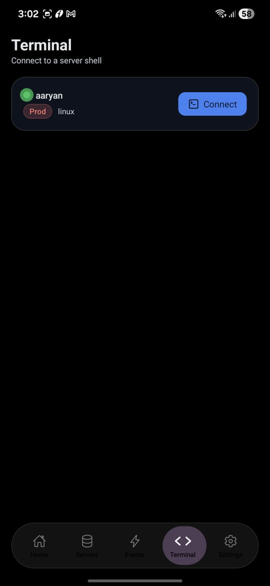
  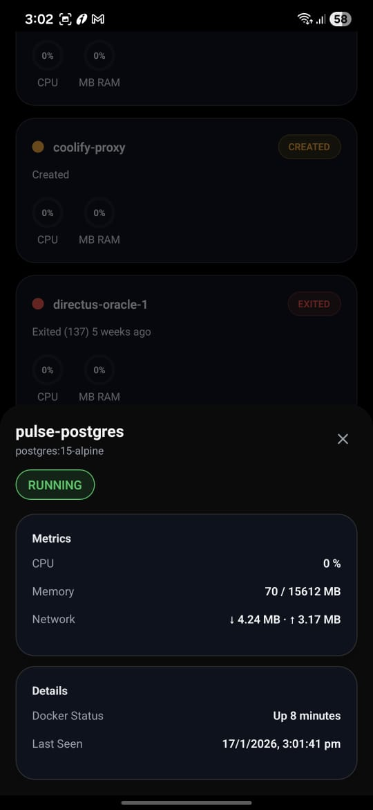
  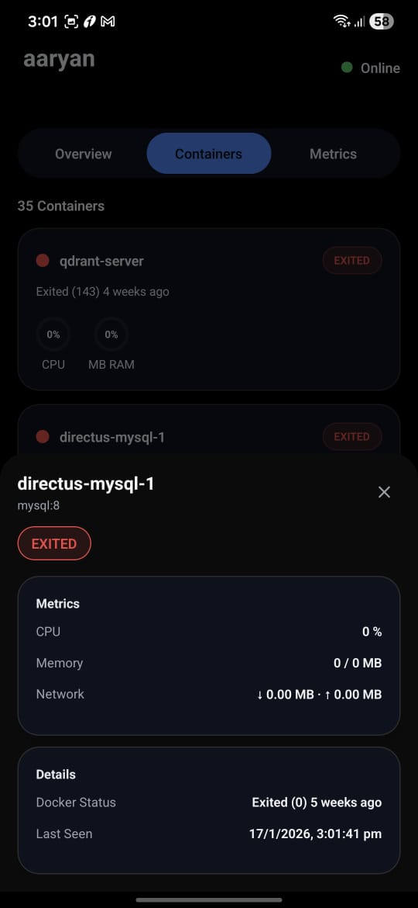
  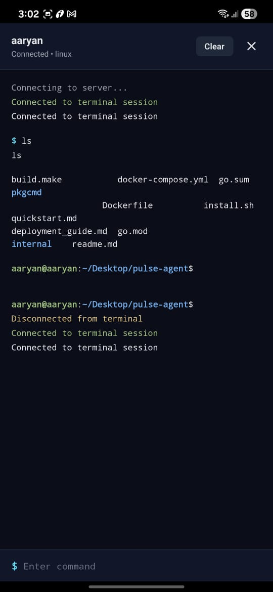
  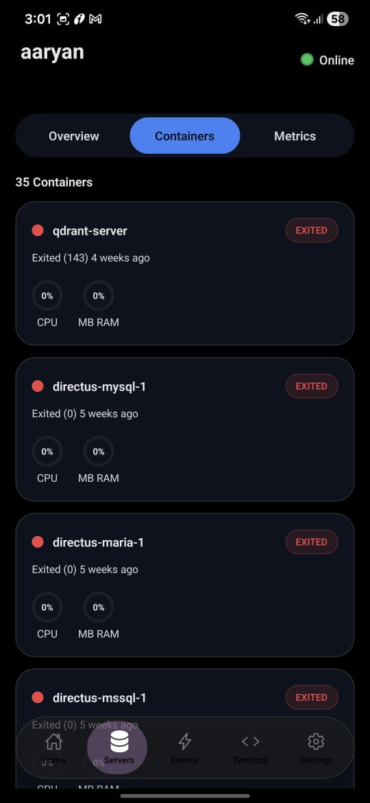
  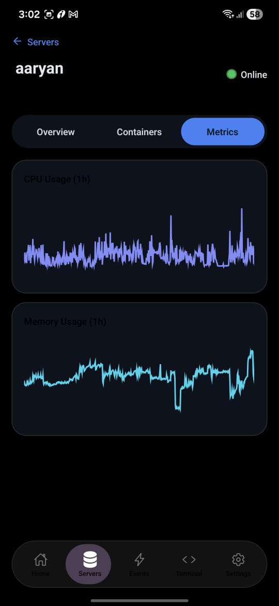
  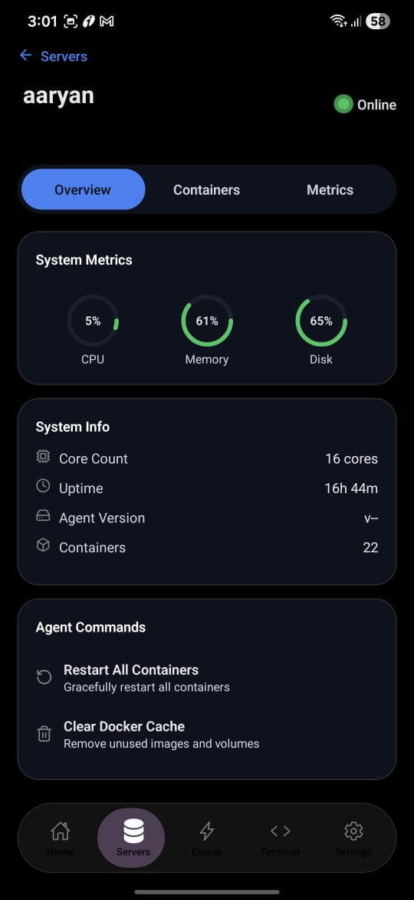
  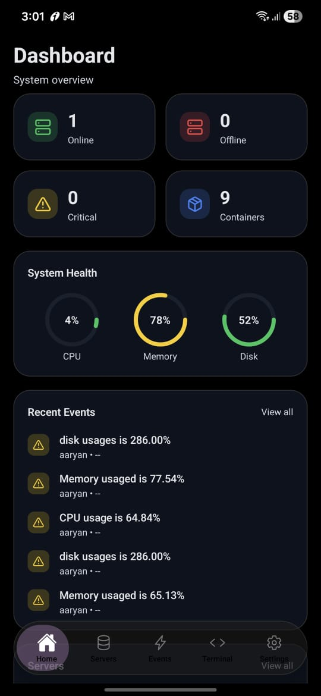

